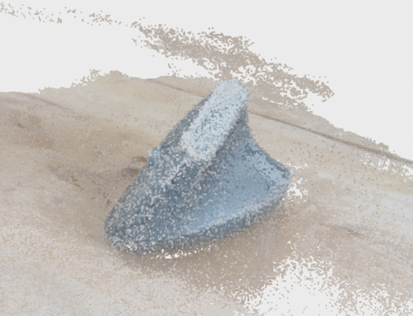

# Notebooks with NeRF

**Nerfstudio**

Create your own NeRF model of an object and visualize it, see [here](https://github.com/deeepwin/nerf/blob/main/nerfstudio.ipynb). Here one example:

<table cellspacing="0" cellpadding="0"><tr>
<td>   </td>
<td>   </td>
<td>   </td>
</tr></table>
